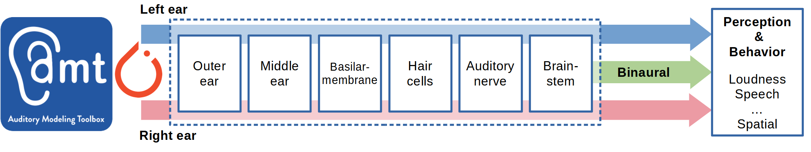

# torch_amt - PyTorch Auditory Modeling Toolbox

[](https://www.gnu.org/licenses/gpl-3.0) [](https://www.python.org/downloads/) [](https://pytorch.org/) [](https://badge.fury.io/py/torch-amt) [](https://torch-amt.readthedocs.io/)

<p align="center">
  
</p>

**Differentiable, GPU-accelerated PyTorch implementations of Computational Auditory models from the MATLAB Auditory Modeling Toolbox (AMT).**

Built for researchers in psychoacoustics, computational neuroscience, and Audio Deep Learning who need:

- 🔥 **Hardware acceleration** for fast batch processing
- 📊 **Differentiable models** for gradient-based optimization  
- 🧩 **Modular components** for custom auditory pipelines
- 🎓 **Scientific adherence** matching MATLAB AMT implementations

---

## 📦 Installation

### From PyPI

```bash
pip install torch-amt
```

### From Source

```bash
git clone https://github.com/StefanoGiacomelli/torch_amt.git
cd torch_amt
pip install -e .
```

### Requirements

- Tested w. Python ≥ 3.14

---

## 🚀 Quick Start

### Complete Auditory Model

```python
import torch
import torch_amt

# Load Dau et al. (1997) model
model = torch_amt.Dau1997(fs=48000)

# Process 1 second of audio
audio = torch.randn(1, 48000)  # (batch, time)
output = model(audio)

print(f"Input: {audio.shape}")
# Input: torch.Size([1, 48000])
print(f"Output: List of {len(output)} frequency channels")
# Output: List of 31 frequency channels
print(f"Each channel shape: {output[0].shape}")
# Each channel shape: torch.Size([1, 8, 48000]) - (batch, modulation_channels, time)
```

### Custom Processing Pipeline

```python
import torch
import torch_amt

# Build custom auditory processing chain
filterbank = torch_amt.GammatoneFilterbank(fs=48000, fc=(80, 8000))
ihc = torch_amt.IHCEnvelope(fs=48000)
adaptation = torch_amt.AdaptLoop(fs=48000)

# Process signal
audio = torch.randn(2, 48000)     # Batch of 2 signals
filtered = filterbank(audio)      # (2, 31, 48000) - 31 frequency channels
envelope = ihc(filtered)          # (2, 31, 48000) - Envelope extraction
adapted = adaptation(envelope)    # (2, 31, 48000) - Temporal adaptation

print(f"Input: {audio.shape}")
# Input: torch.Size([2, 48000])
print(f"After Gammatone filterbank: {filtered.shape}")
# After Gammatone filterbank: torch.Size([2, 31, 48000])
print(f"After IHC envelope: {envelope.shape}")
# After IHC envelope: torch.Size([2, 31, 48000])
print(f"After adaptation: {adapted.shape}")
# After adaptation: torch.Size([2, 31, 48000])
```

### Hardware Acceleration

```python
import torch
import torch_amt

# Check available hardware
print(f"CUDA available: {torch.cuda.is_available()}")
print(f"MPS available: {torch.backends.mps.is_available()}")

# Move model to GPU (CUDA or MPS)
model = torch_amt.Dau1997(fs=48000)

if torch.backends.mps.is_available():
    model = model.to('mps')  # Apple Silicon
    print(f"Using device: mps")
elif torch.cuda.is_available():
    model = model.cuda()  # NVIDIA GPU
    print(f"Using device: cuda")
else:
    print(f"Using device: cpu")

# Process on accelerated hardware
audio = torch.randn(8, 48000).to(model.gammatone_fb.fc.device)
output = model(audio)
```

### Learnable Models for Neural Networks

```python
import torch
import torch.nn as nn
import torch_amt

class AudioClassifier(nn.Module):
    def __init__(self):
        super().__init__()
        # Learnable auditory front-end
        self.auditory = torch_amt.King2019(fs=48000, learnable=True)
        self.classifier = nn.Linear(155, 10)  # 31 freqs × 5 mods = 155 → 10 classes
    
    def forward(self, audio):
        features = self.auditory(audio)     # (B, T, F, M) e.g., (4, 24000, 31, 5)
        pooled = features.mean(dim=1)       # (B, F, M) e.g., (4, 31, 5) - Pool over time
        flattened = pooled.flatten(1)       # (B, F×M) e.g., (4, 155)
        return self.classifier(flattened)   # (B, 10)

# Train end-to-end with backpropagation
model = AudioClassifier()
optimizer = torch.optim.SGD(model.parameters(), lr=1e-1)

# Example forward pass
audio = torch.randn(4, 24000)  # Batch of 4 signals, 0.5 seconds @ 48kHz
logits = model(audio)  # (4, 10)
print(f"Input: {audio.shape} → Output: {logits.shape}")
# Input: torch.Size([4, 24000]) → Output: torch.Size([4, 10])
```

---

## 📚 Available Models

| Model | Year | Key Features | Use Cases |
|-------|------|--------------|-----------|
| **Dau1997** | 1997 | Adaptation loops, modulation filterbank | AM detection, temporal processing |
| **Glasberg2002** | 2002 | Specific loudness, temporal integration | Loudness perception, hearing aids |
| **Moore2016** | 2016 | Binaural processing, spatial smoothing | Binaural loudness, spatial hearing |
| **King2019** | 2019 | Broken-stick compression, FM/AM analysis | FM masking, modulation interactions |
| **Osses2021** | 2021 | Extended temporal integration | Speech perception, temporal resolution |
| **Paulick2024** | 2024 | Physiological IHC, CASP framework | Physiological modeling, cochlear implants |

---

## 📖 Documentation

- **API Reference**: See docstrings (comprehensive documentation with equations and examples)
- **Documentation**: https://torch-amt.readthedocs.io/en/latest/index.html
- 🤝 **Contributing**: See [DEV](./dev/) templates

---

## 📊 Performance

TODO: Placeholder table w. Components runtime analysis forward over 10 runs, and final forward+backward (on CPU, GPU, MPS)

---

## 📄 License

This project is aligned to the original AMT license, hence licensed under the **GNU General Public License v3.0 or later (GPLv3+)**. See [LICENSE](LICENSE) for full details.

---

## 🙏 Acknowledgments

This work is based on the **Auditory Modeling Toolbox (AMT)** developed by:

- Piotr Majdak
- Clara Hollomey  
- Robert Baumgartner
- ...and many contributors from the auditory research community

**Reference:**
> Majdak, P., Hollomey, C., & Baumgartner, R. (2022). "AMT 1.x: A toolbox for reproducible research in auditory modeling." *Acta Acustica*, 6, 19. https://doi.org/10.1051/aacus/2022011

**Official Site:** https://amtoolbox.org/

Individual model implementations are based on their respective publications (see docstrings for specific citations).

---

## Contacts

**Stefano Giacomelli**  
ICT - Ph.D. Candidate  
Department of Engineering, Information Science & Mathematics (DISIM dpt.)
University of L'Aquila, Italy

{width="400" height="150"}

📧 Email: stefano.giacomelli@graduate.univaq.it  
🔗 GitHub: https://github.com/StefanoGiacomelli 
🆔 ORCID: https://orcid.org/0009-0009-0438-1748 
🎓 Scholar: https://scholar.google.com/citations?user=l-n0hl4AAAAJ&hl=it  
💼 LinkedIn: https://www.linkedin.com/in/stefano-giacomelli-811654135

*This project is funded under the Italian National Ministry of University and Research, for the Italian National Recovery and Resilience Plan (NRRP) "Methods of Computational Auditory Scene Analysis and Synthesis supporting eXtended and Immersive Reality Services"*

---

## 📝 Citations

If you use torch_amt in your research, please cite:

```bibtex
@software{giacomelli2026torch_amt,
  author = {Giacomelli, Stefano},
  title = {torch\_amt: PyTorch Auditory Modeling Toolbox},
  year = {2026},
  url = {https://github.com/StefanoGiacomelli/torch_amt},
  version = {0.1.0}
}
```

Also consider citing the original AMT papers.
